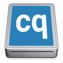
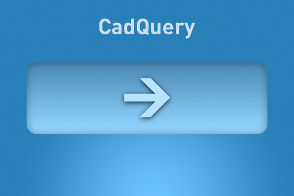

## macOS CQ-Editor Build Files

This directory contains build scripts and resources to build a standalone macOS application bundle of the CQ-Editor.

## Requirements

- XCode - Apple Developer IDE, compilers, and build utilities.  Available from the macOS App Store.
- [brew](https://brew.sh) - a popular macOS package manager
- conda - virtual python environments with packaging. The  [miniconda](https://docs.conda.io/en/latest/miniconda.html) variant of conda is recommended for a minimal installation without unnecessary libraries and packages.

## conda environment

The `macos_env.yml` file specifies a conda environment which can be used to build and/or run the CQ-Editor. This command will create a new conda environment named `cqgui` containing the necessary tools and libraries:

```shell
$ conda env create -f macos_env.yml -n cqgui
$ conda activate cqgui
```

## pyinstaller

The `pyinstaller.spec` file contains the build specification to build all platform variants of the CQ-Editor.  The macOS specific section of this file is as follows:

```python
app = BUNDLE(
    coll,
    name="CQ-Editor.app",
    icon="icons/cadquery_logo_dark.icns",
    bundle_identifier="org.cadquery.cqeditor",
    info_plist={
        "CFBundleName": "CQ-Editor",
        "CFBundleShortVersionString": "0.1.0",
        "NSHighResolutionCapable": True,
        "NSPrincipalClass": "NSApplication",
        "NSAppleScriptEnabled": False,
        "LSBackgroundOnly": False,
    },
)
```

The `CFBundleShortVersionString` key in the `info_plist` dictionary can be changed to the desired version number of the build.

## Building the Application Bundle

To build the application bundle using pyinstaller, a convenient build script is contained in this folder and can be executed as follows:

```shell
$ ./makeapp.sh
```

Alternatively, pyinstaller can be run directly from the repository root directory as follows:

```shell
$ pyinstaller --onedir --windowed --clean -y pyinstaller.spec
```

The resulting application bundle `CQ-Editor.app` will be found in the `dist` directory.  Verify that it works by double-clicking the `CQ-Editor.app` file in the Finder or the standalone executable `dist/CQ-Editor/CQ-Editor`.  

## Building a DMG Installer

To distribute an application bundle, a disk image file (.DMG) is typically used as a convenient single file container format. A DMG file also allows the application bundle to be compressed for efficiency.  A DMG file can be created from the application bundle using the build script in this folder:

```shell
$ ./makedmg.sh
```

The `makedmg.sh` script file has a variable called `version` which can be changed to match the `CFBundleShortVersionString` key in the `pyinstaller.spec` file.

This script requires the following helper components:

- [dmgbuild](https://github.com/al45tair/dmgbuild/blob/master/doc/index.rst) : python utility which creates `dmg` files with a great deal of customization (install using pip)
- [fileicon](https://github.com/mklement0/fileicon) : a small utility which can assign custom icons to macOS files and/or folders (install using brew)

## Resource Files

| Resource | File | Description |
| --- | --- | --- |
|  | `icons/cadquery_logo_dark.icns` | `CQ-Editor.app` application icon |
|  | `CQDiskImageIcon.png` | DMG file icon |
|  | `./CQInstallerBackground.png` | DMG folder background image |


